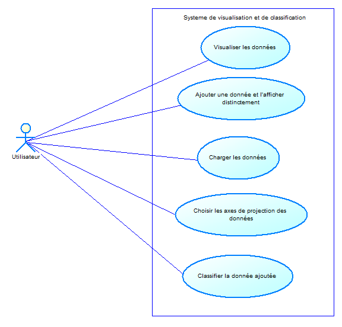
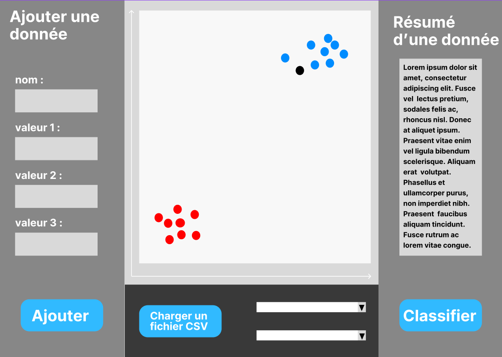
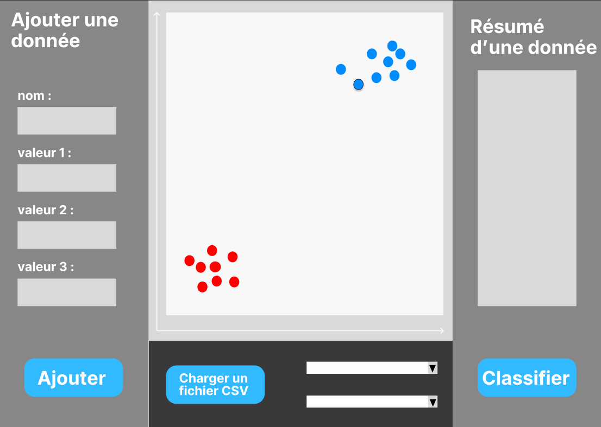
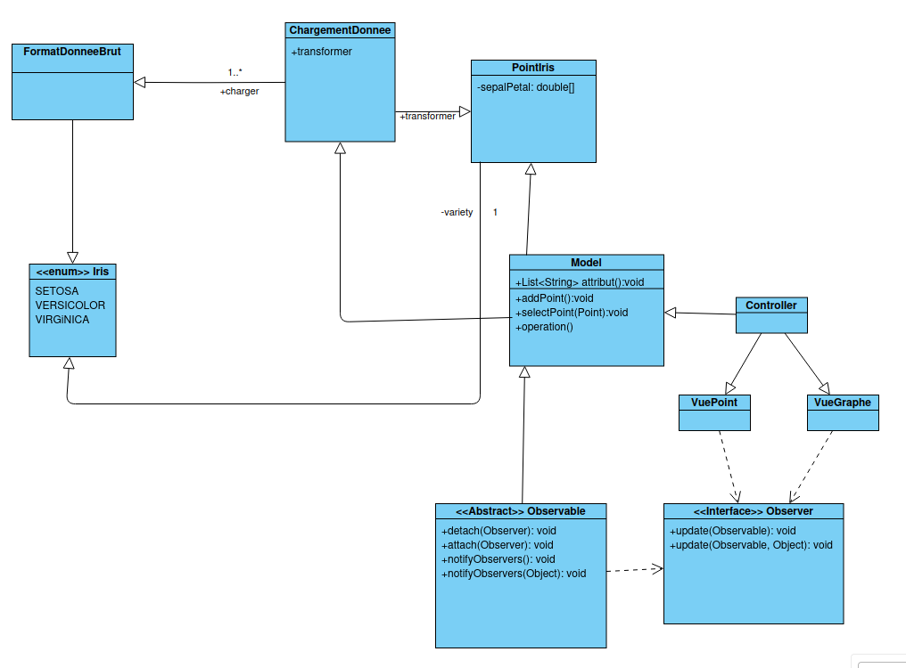

*Vous devez rendre un dossier analyse qui suit le plan ci-dessous, au format PDF.*

---------------------------------------------------------------

# Titre

### Équipe 
H3
Dylan Zhang
Imad Mahmadi
Tom Lelievre
Remi Poupard-Ramaut
 
### Organisation du travail

*Pour chaque membre de l'équipe, préciser en 2--3 lignes:*

- *Comment il ou elle a contribué au projet dans son ensemble.*
- *Comment il ou elle a contribuer plus particulièrement au dossier d'analyse.*

Au niveau du projet dans son ensemble: 

Rémi a travaillé sur le fait de pouvoir créer de nouvelles fenêtres. 
Il s'est également occupé du css, du chargement de CSV, et de la généricité.

Tom s'est occupé du fait de pouvoir créer de nouveaux points, de la classification,
des contrôleurs et du knn

Imad s'est occupé du knn, des tests, de la javadoc, du zoom/dézoom et de simplifications
de navigation pour l'interface

Dylan s'est occupé de la sélection d'axe, de l'affichage des points sur le graphe, de
l'affichage du graphe et de l'affichage de la légende

## Diagramme de cas d'utilisation

### Fiches descriptives

- *Charger l'ensemble de données*

**Système** : Visualisation et Clasification de données

**Cas d'utilisation** : Charger l'ensemble des données

**Acteur principal** : Utilisateur

**Déclencheur** :

**Autre acteurs** :

**Précondition** : L'application doit être fonctionnel

**Garantie en cas de succés** : Les données ont bien été chargé dans le système

**Garantie minimale** : Le fichier chargé n'est pas compatible.

**Scénario nominale** :

1. L'Utilisateur entre et charge les fichiers de données dans le système

1. Le Système vérifie les fichiers de données entré et valide

**Scénario alternatif** :
**A.**

A l'étape 2. , le système échoue de vérifier les données

2. (A) Le Système indique les fichiers de données sont incompatible et demande de re donner un fichier valide.

*Retour étape 1*

- *Ajouter une donnée*

**Système** : Visualisation et Classification de données

**Cas d'utilisation** : Ajouter une donnée

**acteur principal** : Utilisateur

**déclencheur** : /

**autres acteurs** : /

**Préconditions** : Le programme est déjà lancé.

**garanties en cas de succès** : Une nouvelle donnée apparaitra sur l'écran.

**garanties minimales** :
- message d'erreur
- aucune donnée ajouté

**Scénario nominal** :

1. L'utilisateur doit entrer les champs nécessaires et cliquer sur "ajouter".
1. Le système affiche la donnée et l'ajoute dans la liste des données à classifier.

**Scénario alternatif** :

**A,**

A l'étape 2, le système échoue à ajouter une donnée.

2. (A) Le système affiche un message d'erreur expliquant quel(s) champ(s) n'est ou ne sont pas remplis.

*Retour à l'étape 1*

- *Classifier la donnée non classifiée*

**Système** : Visualisation et Classification de données

**Cas d'utilisation** : Classifier une donnée

**acteur principal** : Utilisateur

**déclencheur** : /

**autres acteurs** : /

**Préconditions** :
- Le programme est déjà lancé.
- La donnée à classifier ne l'est pas encore.
- Une donnée ajoutée est en attente d'être classifiée

**garanties en cas de succès** : La donnée sera classifiée.

**garanties minimales** :
- Message d'erreur
- La donnée ne sera pas classifiée

**Scénario nominal** :
1. L'utilisateur vérifie les informations de la donnée puis clique sur le bouton "Classifier"
2. Le système va ajouter la nouvelle donnée dans la structure de donnée

**Scénario alternatif** :

**A,**

A l'étape 2, le système échoue à classifier la donnée.

2. (A) Le système affiche un message d'erreur et ne classifie pas la donnée.

*Retour à l'étape 1*

### Prototypes pour l'interface

*Inclure des prototypes de l'interface utilisateur pour ces fonctionnalités:*

[Lien vers le protoype](https://www.figma.com/proto/RA8E7wizTGvLpUARaOm3Cr/Untitled?node-id=1-624&node-type=canvas&t=WwU2hJEKHKwULUdR-1&scaling=min-zoom&content-scaling=fixed&page-id=0%3A1&starting-point-node-id=1%3A221)  

    
  Lorsque l'utilisateur clique sur "Ajouter", la donnée apparait sur le graphe de manière distincte, ici en noir. Le resumé des valeurs de la donnée est affiché sur la droite.

  
  Après avoir ajouté une donnée, l'utilisateur peut la classifier. Auquel cas, le point prend la couleur correspondante à la catégorie donnée par le système en gardant un moyen de la différencier, ici grâce au contour noir, et reste affiché sur le graphe de manière permanente.

  

*Chaque prototype est constitué d'une suite d'écrans, ou d'une arborescence d'écrans si plusieurs chemins d'interaction sont possibles.*

*Pour les deux fonctionnalités dont on demande le prototype et la fiche descriptive, vous ferez le lien entre le prototype et la fiche descriptive. Plus précisément, pour chaque étape de la fiche descriptive, vous indiquerez à quel écran elle correspond. Vous pouvez par exemple mettre une légende sous l'écran, par ex. "Écran pour l'étape 3 de la fiche descriptive du UC Ajouter une donnée."*

*Les prototypes peuvent être en faible fidélité.*

*Les prototypes peuvent être dessinés à la main ou générés en utilisant un logiciel. Dans les deux cas, veillez à ce que les images soient lisibles et avec une bonne résolution (possibilité de zoomer pour lire le texte qui s'y trouve).*

## Diagramme de classes

